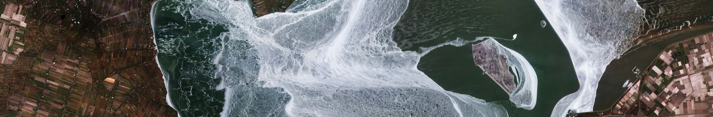

# ARLIE - Product Overview

***

#### About

ARLIE, which stands for Aggregated River and Lake Ice Extent, is an integral component of the High-Resolution Snow & Ice (HR-S&I) monitoring suite offered by the Copernicus Land Monitoring Service (CLMS), operating under the European Environmental Agency (EEA). This data provides a comprehensive spatial overview of ice conditions in European rivers and lakes, leveraging data from optical and radar observations obtained through the Sentinel-2 and Sentinel-1 satellite constellations.
 
ARLIE offers valuable insights into the presence of ice and snow, but furthermore includes information about open water, clouds, and other features such as vegetation and bare soil ❄️🌊☁️🌱
 
Functioning as a spatial aggregation, ARLIE combines data from the River and Lake Ice Extent products (RLIE S1, RLIE S2, and RLIE S1+S2 products). It describes the surface coverage of lakes and rivers as defined by the EU-Hydro database on 10 km river sections and lakes. The data is stored in a geodatabase using the European ETRS89 LAEA coordinate system (EPSG: 3035), and accessibility is facilitated through a REST API. The ARLIE S1+S2 geodatabase is updated daily with input RLIE products computed from the previous day. Quality control is ensured by calculating a spatial average of RLIE S1, RLIE S2, and RLIE S1+S2 QC values.
 
For a more comprehensive description of the product, please refer to the Copernicus [homepage](https://land.copernicus.eu/pan-european/biophysical-parameters/high-resolution-snow-and-ice-monitoring/ice-products/aggregated-river-and-lake-ice-extent), the [Product User Manual](https://land.copernicus.eu/user-corner/technical-library/hrsi-ice-pum), and the [Technical Note](https://land.copernicus.eu/user-corner/technical-library/aggregated-river-and-lake-ice-extent-s1-s2-usage-manual) for the HR-S&I products.
 

#### Repository content

This repository serves as an introductory resource for understanding the ARLIE product, offering practical guides and use cases for data analysis and manipulation. Whether you're a beginner or an experienced user, you can run these notebooks on your preferred platform. If you're unsure where to begin, we recommend exploring how to use Jupyter Notebooks with this helpful [guide](https://www.codecademy.com/article/how-to-use-jupyter-notebooks). If you prefer an alternative option, you can consider to use the [WekEO](https://help.wekeo.eu/en/articles/6337538-what-is-the-wekeo-jupyterhub) platform to run your notebooks.
 
Overview of notebooks: 
- [How to get started](#how-to-get-started.ipynb)
1) Initial setup
2) Pick your AOI
3) Import your geometry and display it
4) Transform to WKT format
5) Request ARLIE data
6) Display ARLIE data
7) Display EU Hydro data
- [Use case example 1 ](#use-case-1.ipynb)
1) Load ARLIE data and geometries into dataframes
2) Plot ARLIE time series
3) Visualise EU Hydro lakes on a map
4) Examine annual differences in lake ice extend
- [Use case example 2 ](#UseCase1.ipynb)
1) Retrieve and organise ARLIE data for Lake Öskjuvatn
2) Sanity check data and filter noisy observations
3) Analyse time series for Lake Öskjuvatn
 

#### Legal notice

Access to data is based on a principle of full, open and free access as established by the Copernicus data and information policy Regulation (EU) No 1159/2013 of 12 July 2013. This regulation establishes registration and licensing conditions for GMES/Copernicus users and can be found here: http://eur-lex.europa.eu/legal-content/EN/TXT/?uri=CELEX%3A32013R1159.
